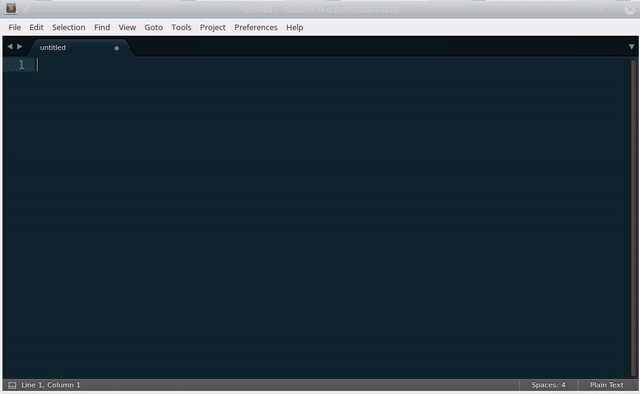

### Sublime PythOnSelection

## About
A Sublime Text 3 plugin that executes Python code on the selected text.

This plugin provides two commands: 'Eval on each selection' and 'Format each selection'. The first one executes Python code on the current selection, while the second outputs the result of the given string formatting syntax.

## Installing
The easiest way to install PythOnSelection is through Package Control, which can be found at this site: [http://wbond.net/sublime_packages/package_control](http://wbond.net/sublime_packages/package_control)

## Code execution

The 'Eval on each selection' command asks the user to input a single line Python expression that is executed on the current seletion (or on each selection in case of multiple carets). The code can access the following variables:

* `v` is the value of the selection
* `i` is the index of the selection (`0` in case of single selection)
* `si` is the index value converted to string
* `l` is the number of characters of the current selection
* `sl` is the number of characters of the current selection converted to string
* `_` is a shortcut to a space character (i.e. `" "`)
* `f` is a function that called on a string as `f(somestring)` executes `somestring.format(**vars)` where `vars` are all the above variables.

You have also access to some preimported modules, `string`, `math`, and `re`.

## Format

The 'Format each selection' command asks the user to input a formatted string with the syntax used by the Python `format()` string method. The given string is then formatted with the following variables:

* `v` is the value of the selection
* `i` is the index of the selection (`0` in case of single selection)
* `l` is the number of characters of the current selection

## Code execution examples

Remember that the selection is always a string, and that the output of your command shall be either a string or a Python object that can be converted to a string.

To start select some text and then run PythOnSelection: Eval on each line giving the command `v.upper()` that executes the `upper()` Python method of the variable `v` that contains the value of the selection.

You can use all the methods of Python strings. For example `v.rjust(10)` left pads the selection with spaces so that the length becomes 10.

Everything works with multiple selections or multiple carets

The variable `si` contains the index of the current line (starting from 0) as a string, which is useful if you want to quickly name different variables or create a 0-indexed list.

If you need to access the index but perform some math on it, you can use the variable `i`, that contains the index in integer form. Try to execute `str(i + 1)` to get a nice list that starts from 1.

The variable `l` contains the length of the selection, i.e. `len(v)`, as an integer. The variable `sl` is the same in string format. To insert spaces you can use `' '` or the underscore character `_` as a shortcut. For example you can execute `v + _ + sl`.

You can use the string `format()` method to get advaced formatted output. For example try `'[{}] ({})]'.format(v, i)`

Since `'somestring'.format(v, i, ...)` is a useful command, you can access `f()`. The function `f(somestring)` is an alias for `somestring.format(**vars)`, where `vars` are the other variables: `v`, `i`, `si`, `l`, `sl`. Try to select some text and execute `f('* [{i}] {v}')`

Your Python expression can include the following modules: `string`, `math`, and `re`. You can try `v.translate({ord(k):_ for k in string.punctuation})` to remove all punctuation characters or `re.sub(r'_', ' ', v)` to replace all underscores with a space.

## Format examples

* **0-indexed list**: select the beginning of some lines (multiple caret) and execute `{i} `
* **Put a left-aligned index (up to 99)**: select the beginning of some lines (multiple caret) and execute `{i:>2} `
